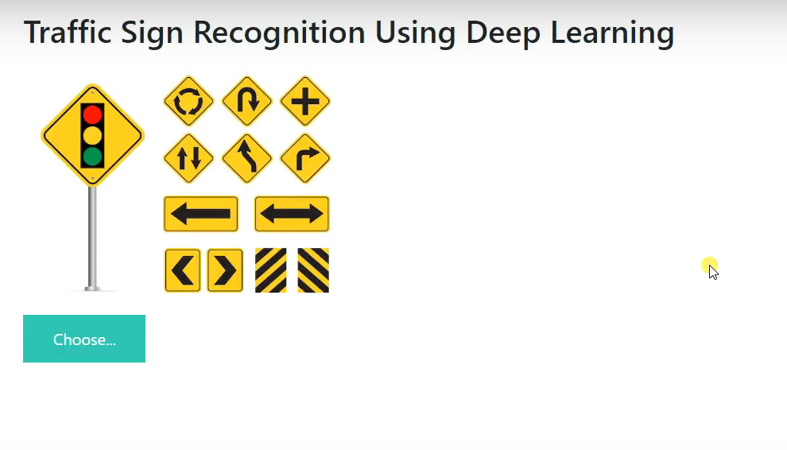
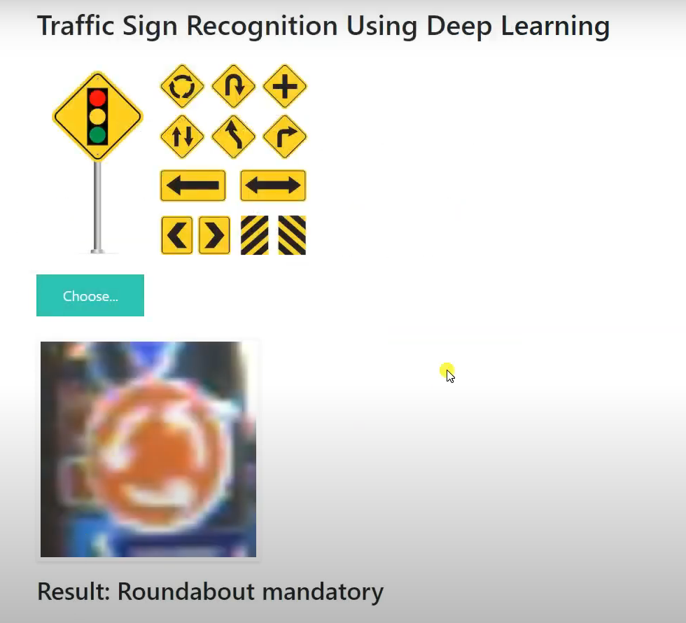

# Traffic Sign Detection Project
This project implements a traffic sign detection system using python ,flask and tensorflow. It identifies and classifies traffic signs in images or videos, aiding in autonomous vehicle navigation and road safety.

## Table of Contents

- [Overview](#overview)
- [Features](#features)
- [Installation](#installation)
- [Usage](#usage)


## Overview

The objective of project is to help the users identify the traiffic sign and create awareness about the traffic signs.

## Features

- Accurate Prediction:Highlight the model's ability to accurately detect and classify various types of traffic signs, including common and less common variants.

- Real-Time Detection:plement real-time detection capabilities, demonstrating the system's ability to process and classify traffic signs in live video streams or camera feeds.

- User-Friendly Interface:Develop a clear and intuitive user interface using Flask, allowing users to upload images, view detection results, and interact with the system easily.

- Traffic Sign Localization:Include the ability to localize detected traffic signs within images or frames, providing bounding boxes or regions of interest for each detected sign.
.

## Installation

Provide step-by-step instructions on how to install and configure the necessary dependencies to run your project.

```bash
# Clone the repository
git clone https://github.com/yourusername/traffic-sign-detection.git
cd traffic-sign-detection

# Create and activate a virtual environment (optional but recommended)
python -m venv venv
source venv/bin/activate  # for Unix/Mac
venv\Scripts\activate  # for Windows

# Install required packages
pip install -r requirements.txt
```

## Usage


```bash
# Run the Flask application
python app.py
```

Open your web browser and go to `http://localhost:5000` to access the application.


### Sample Images

Include images relevant to your project. Here are some suggestions:

1. **Input Image**: Example input image with traffic signs.
   

2. **Detection Result**: Example output showing detected traffic signs.
   


